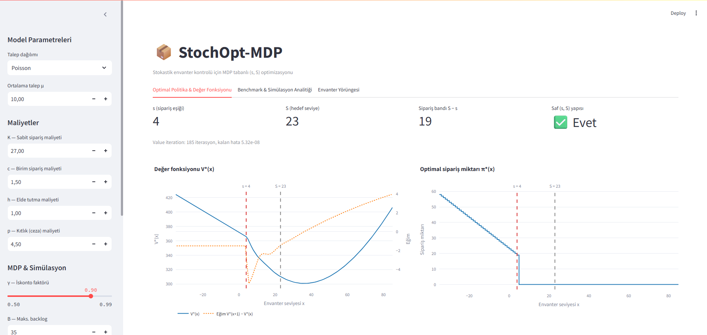
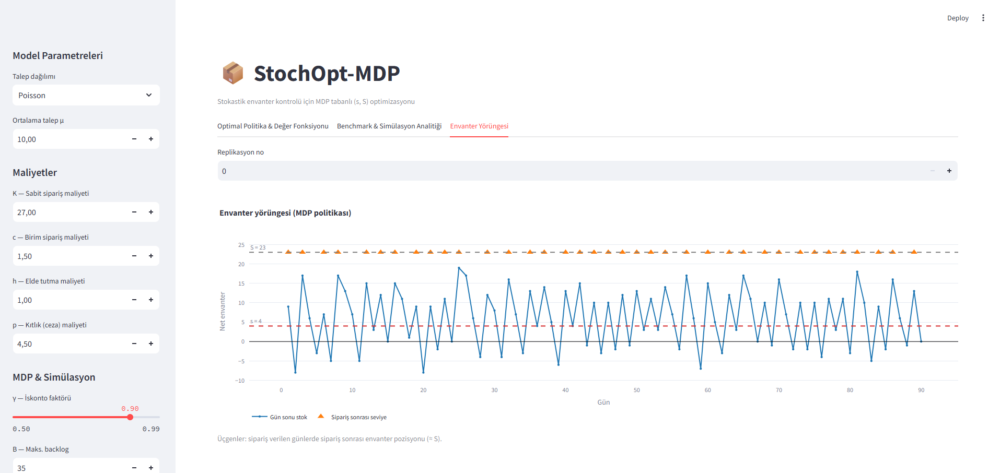

# StochOpt-MDP

**Optimal (s, S) inventory control via Markov Decision Processes, validated by discrete-event simulation.**

StochOpt-MDP formulates single-item, periodic-review stochastic inventory control with backlogging as a
discounted infinite-horizon MDP, solves the **Bellman equation** by a fully vectorised value iteration
(one matrix–vector product plus a suffix-minimum per sweep), and stress-tests the resulting policy in a
SimPy Monte Carlo environment against classical heuristics. The repository ships the solver, the
simulator, a typed FastAPI service and a Streamlit dashboard.

*Keywords: Operations Research, Dynamic Programming, Bellman Equation, Stochastic Inventory, (s, S) Policies,
K-convexity, Discrete-Event Simulation.*

---

## Mathematical formulation

**Model.** Periodic review, i.i.d. integer demand $D \in \{0, 1, 2, \dots\}$ (Poisson or Negative Binomial),
full backlogging, zero lead time. Costs: fixed order cost $K$, unit order cost $c$, holding $h$, shortage $p$;
discount factor $\gamma \in (0, 1)$.

**State.** Net inventory at the start of a period

$$x \in \mathcal{S} = \{-B, -B+1, \dots, C\}, \qquad |\mathcal{S}| = B + C + 1,$$

where negative values are backorders. $B$ (max backlog) and $C$ (capacity) make the state space finite.

**Action.** Order $a = y - x \ge 0$, i.e. raise the inventory position to $y \in \{x, \dots, C\}$.

**One-period expected holding/shortage cost.** Charged on the end-of-period stock $y - D$:

$$L(y) = h\,\mathbb{E}\left[(y - D)^+\right] + p\,\mathbb{E}\left[(D - y)^+\right]$$

With $F(k) = P(D \le k)$ and $M(k) = \sum_{d \le k} d\,P(D = d)$, both expectations are cumulative sums,
so $L$ is evaluated on the whole grid at once (`core/cost.py`):

$$\mathbb{E}\left[(y - D)^+\right] = y\,F(y-1) - M(y-1)$$

$$\mathbb{E}\left[(D - y)^+\right] = \mathbb{E}\left[(y - D)^+\right] + \mathbb{E}[D] - y$$

**Bellman equation.**

$$V^*(x) = \min_{y \ge x} \left[ K \cdot \mathbf{1}_{\{y > x\}} + c(y - x) + L(y) + \gamma W(y) \right]$$

$$W(y) = \mathbb{E}_D \left[ V^*(\max(y - D, -B)) \right]$$

Backlog below $-B$ is absorbed at $-B$ (truncation). The key observation is that $W$ depends **only on $y$**, so
each Bellman sweep is

1. $W = P V$ — a single matrix–vector product with the transition matrix $P_{y,x'} = P(y - D = x')$;
2. $H(y) = c\,y + L(y) + \gamma W(y)$, and $\min_{y > x} H(y)$ for every $x$ via one reverse cumulative minimum,

$$(TV)(x) = -cx + \min \left[ H(x), \; K + \min_{y > x} H(y) \right]$$

which costs $O(|\mathcal{S}|^2)$ per sweep (the product) plus $O(|\mathcal{S}|)$ for the optimisation, instead of
$O(|\mathcal{S}|^3)$ when the expectation is recomputed for every $(x, y)$ pair.

**Stopping rule.** Iterate until the first inequality holds; it guarantees the second:

$$\Vert{}V_{k+1} - V_k\Vert{}_\infty < \varepsilon \frac{1 - \gamma}{2\gamma} \implies \Vert{}V_{k+1} - V^*\Vert{}_\infty < \frac{\varepsilon}{2}$$

**Structure of the optimum.** For $K > 0$, $K$-convexity of the cost-to-go implies an $(s, S)$ policy (Scarf, 1960):

$$\pi^*(x) = \begin{cases} S - x, & x \le s, \\ 0, & x > s. \end{cases}$$

The solver does not assume this; it *checks* it (`is_s_S_optimal`) by verifying that the ordering states form the
prefix $x \le s$ and all reach the same order-up-to level. For $K = 0$ the policy degenerates to base-stock
($S = s + 1$).

---

## Architecture

```
┌────────────────────┐   ┌────────────────────────┐   ┌───────────────────┐   ┌──────────────────────┐
│        core/       │   │      simulation/       │   │       api/        │   │      dashboard/      │
│ demand.py          │──▶│ environment.py (SimPy) │──▶│ schemas.py        │──▶│ app.py (Streamlit)   │
│   Poisson, NegBin  │   │   daily event loop,    │   │   Pydantic v2     │   │ compute.py           │
│ cost.py            │   │   lead-time queue      │   │ main.py (FastAPI) │   │ figures.py (Plotly)  │
│   L(y), vectorised │   │ benchmark.py           │   │   /api/v1/optimize│   │                      │
│ mdp_solver.py      │   │   MDP / BaseStock /    │   │   /api/v1/simulate│   │  reuses api.schemas  │
│   value iteration  │   │   StaticEOQ, CRN MC    │   │   /health         │   │  for validation      │
└────────────────────┘   └────────────────────────┘   └───────────────────┘   └──────────────────────┘
       exact solution         Monte Carlo validation        typed service            interactive UI
```

Each layer only depends on the ones to its left. CPU-bound work in the API runs in worker threads
(`anyio.to_thread`) behind a capacity limiter so the event loop stays responsive.

---

## Benchmark results

Poisson demand with $\mu = 8$; $h = 1$, $p = 5$, $c = 1$, $K = 30$; $\gamma = 0.95$, $B = 40$, $C = 80$;
$T = 365$ days, $N = 1000$ replications, common random numbers (every policy sees the same 1000 demand paths),
initial stock $x_0 = 0$, seed 1.

The MDP solution is $(s, S) = (3, 23)$.

| Policy                      | Mean cost / day (± SE) |   CSL | Fill rate | Stockout-day ratio | Mean on-hand |
| :-------------------------- | ---------------------: | ----: | --------: | -----------------: | -----------: |
| **MDP (s, S)**              |     **28.878 ± 0.014** | 0.831 |     0.927 |              0.209 |         7.90 |
| Base-Stock (newsvendor $S$) |         42.463 ± 0.009 | 0.887 |     0.970 |              0.184 |         3.24 |
| Static EOQ $(s, Q)$         |         31.159 ± 0.020 | 0.683 |     0.819 |              0.363 |         4.98 |

* The MDP policy is **32 % cheaper than Base-Stock** (which pays the fixed cost $K$ almost every day) and
  **7 % cheaper than the static EOQ rule**, which additionally delivers a markedly lower service level
  (CSL 0.68 vs 0.83) because the deterministic $(s, Q)$ carries no safety stock.
  The difference is significant on the paired (common-random-number) comparison.
* **Theory vs. simulation.** $V^*(0) = 596.36$; the simulated mean discounted cost of the MDP policy is
  $597.37 \pm 0.77$ (1.3 standard errors apart). The undiscounted per-day average (28.88) is compared with the
  proxy $(1-\gamma)V^*(0) = 29.82$; the ≈3 % gap is expected because the simulator is undiscounted.

*Definitions.* CSL — share of days with zero shortage. Fill rate — served demand / total demand. Stockout day —
a day ending with net stock $\le 0$. Mean on-hand — average of $\max(x, 0)$ at day end.

---

## Dashboard

<!-- Add screenshots to docs/assets/ with these exact names; the links below will then render. -->
<p align="center">
  
  <br><em>Optimal policy and value function <code>V*(x)</code> (tab 1)</em>
</p>

<p align="center">
  
  <br><em>90-day inventory trajectory with <code>s</code>, <code>S</code> and order days marked (tab 3)</em>
</p>

---

## Installation and usage

```bash
# 1. install (Python >= 3.11)
poetry install

# 2. tests
poetry run pytest -v

# 3. REST API   ->  http://localhost:8000/docs
poetry run uvicorn api.main:app --reload

# 4. dashboard  ->  http://localhost:8501
poetry run streamlit run dashboard/app.py
```

### Library

```python
from core import Poisson
from core.mdp_solver import solve_mdp
from simulation import BaseStockPolicy, BenchmarkEngine, MDPPolicy, StaticEOQPolicy

D = Poisson(8)
sol = solve_mdp(D, holding=1, shortage=5, order_cost=1, fixed_cost=30, gamma=0.95, B=40, C=80)
print(sol.s, sol.S, sol.is_s_S_optimal)  # 3 23 True

engine = BenchmarkEngine(D, 1, 5, 1, 30, gamma=0.95, horizon=365, n_reps=1000, seed=1)
reports = engine.run(
    [MDPPolicy(sol), BaseStockPolicy.from_newsvendor(D, 1, 5), StaticEOQPolicy.from_eoq(D, 1, 30)]
)
print(engine.format_table(reports))
print(engine.compare_with_mdp(sol, reports["MDP"]))
```

### REST API

```bash
curl -X POST localhost:8000/api/v1/optimize -H 'content-type: application/json' -d '{
  "demand": {"type": "poisson", "mu": 8},
  "cost": {"holding": 1, "shortage": 5, "unit_order": 1, "setup": 30}
}'
```

| Endpoint                | Description                                                                                                            |
| :---------------------- | :--------------------------------------------------------------------------------------------------------------------- |
| `POST /api/v1/optimize` | Solve the MDP; returns `s`, `S`, `is_s_S_optimal`, `iterations`, `residual`, `states`, `policy`, `values`              |
| `POST /api/v1/simulate` | Optimise, then benchmark MDP vs Base-Stock vs Static EOQ; adds `T`, `replications`, `seed`                             |
| `GET /health`           | Liveness probe                                                                                                         |

Invalid parameters (`h ≤ 0`, `K < 0`, `μ ≤ 0`, Negative Binomial with `var ≤ μ`, …) return **422** with a
field-level message; domain errors raised by the solver return **400**.

Request limits guard against denial of service: `max_backlog`, `capacity` ≤ 1000; `gamma` ≤ 0.995; `eps` ≥ 1e-8;
`mu` ≤ 10 000; `T × replications` ≤ 1 000 000; value iteration is capped at 10 000 sweeps (a request that would
exceed it returns **400** instead of running unbounded); at most 4 heavy jobs run concurrently.

### Project layout

```
core/         demand.py  cost.py  mdp_solver.py
simulation/   environment.py  benchmark.py
api/          schemas.py  main.py
dashboard/    app.py  compute.py  figures.py
tests/        test_core  test_mdp_solver  test_simulation  test_api  test_dashboard
```

---

## Limitations

* The MDP assumes **zero lead time**. The simulator supports $L > 0$ (pipeline queue, inventory-position
  policies), but `MDPPolicy` is not optimal in that case; that needs the pipeline in the state.
* The state space is truncated at $[-B, C]$: demand beyond $-B$ backlog is absorbed at $-B$, and orders cannot exceed
  capacity $C$. Choose $B$ and $C$ large relative to the demand scale.
* The benchmark heuristics are intentionally simple: Base-Stock uses the classical newsvendor fractile
  ($K = 0$ logic), and Static EOQ is the deterministic EOQ without safety stock.

## License

MIT — see [LICENSE](LICENSE).
